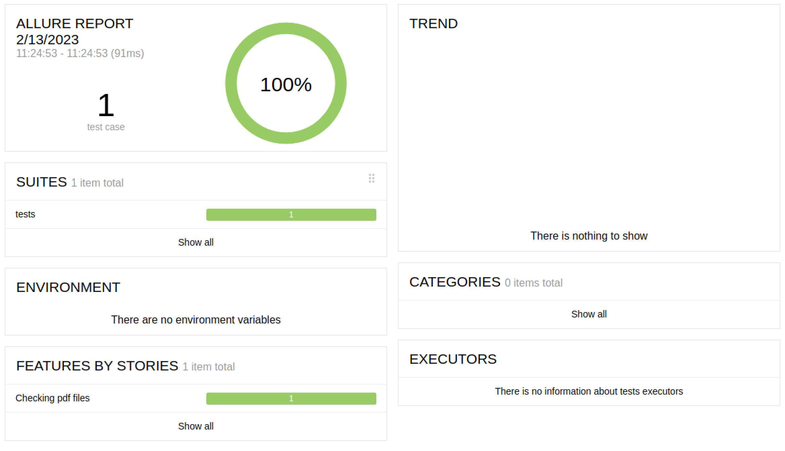

# Project for testing pdf files.


## Requirements
To work with the project, Python version 3.6 or higher is required.

## Installation and launch
1. Download or clone the repository.
2. Install dependencies:
```bash
pip install -r requirements.txt
```

#### List of checks implemented in autotests
- [x] A method has been developed that reads all possible information from a PDF file and returns it as a dictionary at the output.
- [x] Checks incoming pdf files for all elements and structure.


## The project was implemented using
Python, Pytest, PyPDF, Voluptuous, Allure Report


## Local launch of autotests
Command line example:
```bash
pytest -s -v --alluredir=allure-results
```

Getting a report:
```bash
allure serve
```

### Пример отчёта выполнения одного из автотестов

